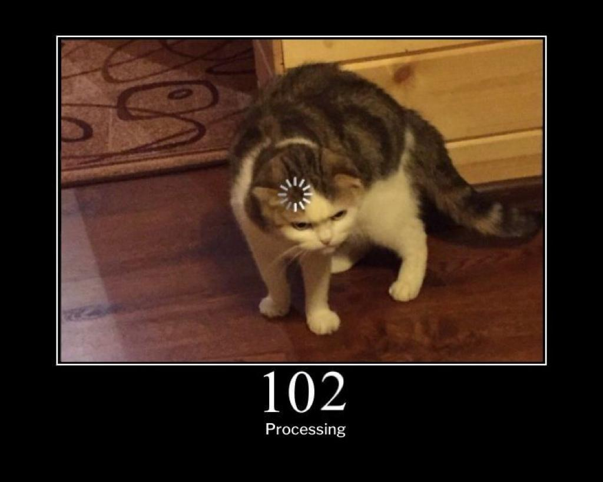

# ***On16-TodasEmTech-s6-Intro-API-Node***
Turma Online 16 | Back-end | Maio, 2022 

Semana 06 - {REprograma} - Introdução à API: HTTP e NodeJS 
#

# **Conteúdo Programático** :computer: 
- Modelo Server/Client;
- URL, Domínio, IP, DNS;
- Protocolo HTTP;
- Request e Response;
- API e API Rest;
- Node.js, npm e yarn;
- JSON.

#

