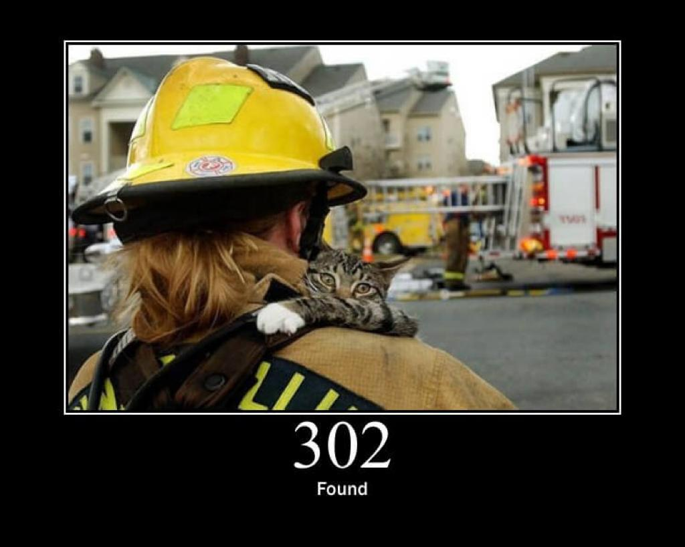

# ***On16-TodasEmTech-s6-Intro-API-Node***
Turma Online 16 | Back-end | Maio, 2022 

Semana 06 - {REprograma} - Introdução à API: HTTP e NodeJS 
#

# **Conteúdo Programático** :computer: 
- Modelo Server/Client;
- URL, Domínio, IP, DNS;
- Protocolo HTTP;
- Request e Response;
- API e API Rest;
- Node.js, npm e yarn;
- JSON.


#


# **Para casa** :house:
### Abra o PullRequest Respondendo as seguintes questões:


#


### **1. Qual a relação entre os métodos HTTP e o CRUD?**

```javascript

    O protocolo HTTP define um conjunto de métodos de requisição responsáveis por indicar a ação a ser executada para um dado recurso.

    [ Exemplos de métodos ]: GET, HEAD, POST, PUT, DELETE, CONNECT, OPTIONS, TRACE, PATCH.
    
    Já o CRUD (Create, Read, Update, Delete) tipicamente refere-se a operações perfomadas em um banco de dados ou base de dados, mas também pode aplicar-se para funções de alto nível de uma aplicação.

    "Na internet há muita discursão na qual desejam mapear o REST para o CRUD diretamente, porque o REST over HTTP fornece GET PUT POST e DELETE, enquanto o CRUD fornece CREATE RETRIEVE UPDATE DELETE. É muito comum querer mapear os verbos REST diretamente para as operações CRUD.
    No entanto, o HTTP usa um estilo 'criar ou atualizar', enquanto o CRUD separa criar e atualizar. Isso torna inviável realizar um mapeamento geral entre ambos."
```

#
### **Referências - Pesquisas - Links:** 

- https://www.brunobrito.net.br/rest-nao-e-crud/
- https://developer.mozilla.org/pt-BR/docs/Glossary/CRUD
- https://developer.mozilla.org/pt-BR/docs/Web/HTTP/Methods

#

### **2. Comente, com exemplos, a diferença entre o PUT e o PATCH.**

```javascript
* PUT: O método de requisição HTTP PUT cria um novo recurso ou subsititui uma representação do recurso de destino com os novos dados;

* PATCH: O método de requisição HTTP PATCH aplica modificações parciais a um recurso;

* Diferença entre o PUT e o PATCH: 

"O método HTTP PUT permite apenas substituições completas de um documento. Em contraste ao PUT, o método PATCH não é idempotente, ou seja, requisições sucessivas idênticas podem obter efeitos distintos. Todavia, é possível realizar requisições PATCH de modo a serem idempotentes."

* Entendendo a diferença com [Exemplos]: 

"Em resumo, PUT(substitui) e PATCH(modifica) são usados para indicar um requisição de alteração de dados. Geralmente, ao usar-se o PUT, fica legível que a alteração do dado será com referência a entidade completa."

1 - Usando o PUT:

Exemplo: (/usuario/1234) :

Resultado: {'id': 1234, 'name': 'Beatriz', 'idade': 27, 'documento': '123.321.12-X'}

2 - Usando o PATCH:

Exemplo: (/usuario/1234) :

Resultado: {'name': 'Beatriz'}

```

#
### **Referências - Pesquisas - Links:** 
- https://developer.mozilla.org/pt-BR/docs/Web/HTTP/Methods/PUT
- https://developer.mozilla.org/pt-BR/docs/Web/HTTP/Methods/PATCH
- https://cursos.alura.com.br/forum/topico-diferenca-entre-put-e-patch-44669
#


### **3. Apresente os dados dos JSONs no console**
```javascript

    [RESOLUÇÃO]: Quesitos 1 e 2 estarão na pasta "para_casa".

    1 - Exercício Ghibli: o título de cada filme e a descrição de cada filme 

    2 - Exercício Pokemón: o nome, descrição e tipo (separadamente) de cada pokemón    
    
    
    [OPCIONAL/EXTRA] : Caso queira exercitar mais. Na pasta "extras", temos alguns jsons, você pode:

    - No colors-rgb.js apresente o nome da cor e o codigo RGB como no exemplo: "gainsboro - rgb(220, 220, 220, 1)"

    - No estados-cidade.js apresente o nome do Estado, a sigla e todas as cidadades, sem arrays aparentes no console

    - No filmes.js apresente titulo, plot, generos e lingua. Genero e lingua devem ser apresentados em arrays no console.


```

### **4. Defina o conceito de idempotência e como uma API pode ser idempotente**

```javascript
* Conceito de Idempotência: Em matemática, Idempotencia é ter a propriedade de poder ser aplicado mais do que uma vez sem que o resultado se altere;

* Um método HTTP é idempotente se uma requisição idêntica pode ser feita uma ou mais vezes em sequência com o mesmo efeito enquanto deixa o servidor no mesmo estado;

* Exemplos de métodos idempotentes: GET, HEAD, PUT, e DELETE;

* API e Idempotência?

"A idempotência garante que uma solicitação de API seja concluída apenas uma vez. Com uma solicitação idempotente, se a solicitação original for concluída com êxito, as novas tentativas subsequentes retornam o resultado da solicitação original bem-sucedida e não terão efeito adicional."

```

#
### **Referências - Pesquisas - Links:** 
- https://docs.aws.amazon.com/pt_br/AWSEC2/latest/WindowsGuide/ebs-direct-api-idempotency.html
- https://developer.mozilla.org/pt-BR/docs/Glossary/Idempotent

#

### **5. Cite alguns diferentes padrões de projetos de software**


```javascript
* O que são padrões de projetos de software? 

    "Os padrões de projeto (design patterns) são como plantas pré-projetadas de uma construção, que você pode alterar para se adequar melhor na resolução de um problema recorrente em seu código."

*  Principais tipos de Padrões de Projetos: 

     " Tais padrões geralmente são divididos e agrupados de acordo com a natureza de cada problema que eles solucionam." 
     
* Padrões de projeto podem ser classificados quanto ao:

    [ESCOPO]: Especificam se o padrão se aplica, primeiramente, a classes ou objetos:

    1 - Padrões de classes: Lidam com relações entre classes e suas sub classes e são estabelecidas por herança.

    2 - Padrões de objetos: Lidam com as relações entre objetos os quais podem ser alterados em tempo de execução.

    [PROPÓSITO]: Reflete basicamente o que o padrão faz, em resumo, suas funcionalidades:

    1 - Padrões criacionais: Oferecem diversas alternativas de criação de objetos, o que aumenta a flexibilidade e a reutilização de código.
     [Exemplos]: Abstract Factory, Builder, [...]

    2 - Padrões estruturais: Mostram como montar objetos e classes em estruturas maiores, sem perder a eficiência e flexibilidade.
     [Exemplos]: Bridge, Composite, Adapter, [...]

    3 - Padrões comportamentais: Ajudam a trabalhar melhor com os algoritmos e com a delegação de responsabilidades entre os objetos.
     [Exemplos]: Interpreter, Command, [...]
    
```
#

### **Referências - Pesquisas - Links:** 
- https://www.alura.com.br/artigos/design-patterns-introducao-padroes-projeto
- http://docplayer.com.br/83296162-Tecnologias-atuais-de-desenvolvimento-de-software.html

#

